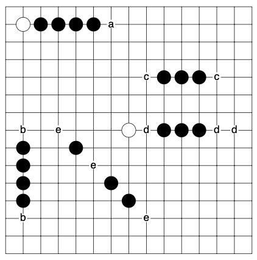

# my-gomoku

An agent that can play strategically against a human!

## Threats

* A threat is an arrangement that creates a potential winning opportunity that the opponent must immediately counter.
* A threat sequence is a series of moves in which each leads to a threat that the opponent must respond to.
* A double threat is a situation where two threats are created simultaneously, making it impossible for the opponent to block both.
* A winning threat sequence is a series of moves that give rise to a double threat, leading to an inevitable win. 

We have the following types of threats (Allis, 1994):

## Reducing the Search Space

Consider forced moves: Suppose we have an immediate threat, such as an unblocked three, then, we should prioritise the subsequent moves that result from the opponent blocking that threat in all possible ways. Or, suppose we have a threat of four, then we can just consider what happens after the opponent blocks that threat, because we know the opponent must take that move.

In the original paper, the author refers to 'squares' &mdash; however, this naming is confusing and so I will call them points instead, as we are really placing pieces at the intersections of the grid.

smb://nts27.comp.nus.edu.sg/psts?encryption=no

The following definitions are in place to help describe the threat-space search:

1. The **gain point** is the point played by the attacker to create a threat.
2. The **cost point** of a threat is the point that the opponent must play to block the threat.
3. The **rest point** of 

